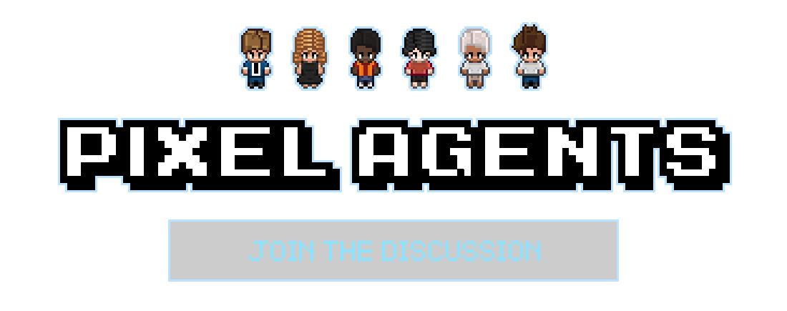
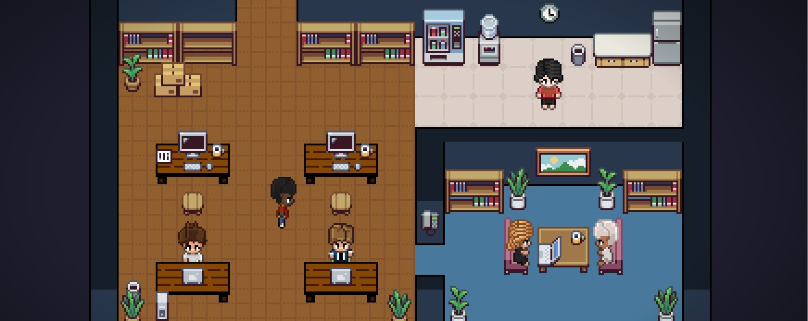

<h1 align="center">
    <a href="https://github.com/pixel-agents-hq/pixel-agents/discussions">
        
    </a>
</h1>

<h2 align="center" style="padding-bottom: 20px;">
  AI 에이전트가 실제 작업을 만드는 과정을 게임처럼 보여주는 인터페이스
</h2>

<div align="center" style="margin-top: 25px;">

[](https://github.com/pixel-agents-hq/pixel-agents/releases)
[](https://marketplace.visualstudio.com/items?itemName=pablodelucca.pixel-agents)
[](https://github.com/pixel-agents-hq/pixel-agents/stargazers)
[](https://github.com/pixel-agents-hq/pixel-agents/blob/main/LICENSE)
[](https://github.com/pixel-agents-hq/pixel-agents/issues?q=is%3Aopen+is%3Aissue+label%3A%22good+first+issue%22)

</div>

<div align="center">
<a href="https://marketplace.visualstudio.com/items?itemName=pablodelucca.pixel-agents">VS Code Marketplace</a> • <a href="https://github.com/pixel-agents-hq/pixel-agents/discussions">Discussions</a> • <a href="https://github.com/pixel-agents-hq/pixel-agents/issues">Issues</a> • <a href="CONTRIBUTING.md">Contributing</a> • <a href="CHANGELOG.md">Changelog</a>
</div>

<br/>

Pixel Agents는 멀티 에이전트 AI 시스템을 "보이고 관리되는" 형태로 바꿉니다.  
각 에이전트는 픽셀 오피스의 캐릭터가 되고, 실제 상태에 따라 행동이 바뀝니다. 예를 들어 코드를 작성할 때는 타이핑, 파일을 읽을 때는 읽기 동작, 사용자 입력을 기다릴 때는 대기 상태를 시각적으로 보여줍니다.

동일한 소스 트리에서 두 가지 형태로 제공됩니다.

- **VS Code 확장**: [VS Code Marketplace](https://marketplace.visualstudio.com/items?itemName=pablodelucca.pixel-agents), [Open VSX](https://open-vsx.org/extension/pablodelucca/pixel-agents)에서 설치 가능
- **Standalone CLI**: `npx pixel-agents`로 Fastify 서버를 띄우고 브라우저 SPA로 오피스를 확인 가능

아키텍처는 에이전트/플랫폼 중립적으로 설계되어 있습니다.  
타입화된 `HookProvider` 인터페이스를 경계로 두어 새로운 AI 도구를 provider 디렉터리 하나로 확장할 수 있습니다. Claude Code가 기본 레퍼런스 구현이며, Codex provider도 지원합니다.



## 주요 기능

- **에이전트당 캐릭터 1개**: 각 터미널 세션이 개별 캐릭터로 표시
- **실시간 활동 추적**: 작성/읽기/명령 실행 등 상태 기반 애니메이션
- **오피스 레이아웃 에디터**: 바닥/벽/가구를 직접 배치
- **말풍선 표시**: 사용자 입력 대기/권한 요청 상태 시각화
- **사운드 알림**: 턴 종료 시 선택적 알림음
- **서브 에이전트 시각화**: Task tool 하위 에이전트도 별도 캐릭터로 표시
- **레이아웃 영속성**: 오피스 디자인 저장 및 VS Code 창 간 공유
- **외부 에셋 디렉터리 지원**: 임의 폴더의 가구 팩 로드 가능
- **다양한 캐릭터**: 6종 캐릭터 제공 (기반 리소스: [JIK-A-4, Metro City](https://jik-a-4.itch.io/metrocity-free-topdown-character-pack))

<p align="center">
  
</p>

## 요구 사항

- VS Code 1.105.0 이상
- 지원 CLI 설치 및 설정
  - [Claude Code CLI](https://docs.anthropic.com/en/docs/claude-code) (기본 provider)
  - Codex CLI (`PIXEL_AGENTS_PROVIDER=codex`)
- 플랫폼: Windows, Linux, macOS

## 빠른 시작

### 일반 사용자

가장 간단한 방법은 [VS Code 확장 설치](https://marketplace.visualstudio.com/items?itemName=pablodelucca.pixel-agents)입니다.

### 소스에서 실행(개발/수정)

```bash
git clone https://github.com/pixel-agents-hq/pixel-agents.git
cd pixel-agents
npm install
npm run build
```

그다음 VS Code에서 **F5**를 눌러 Extension Development Host를 실행합니다.

### Codex + OpenRouter 사용

`.env` 또는 셸 환경 변수에 아래 값을 설정하세요.

```bash
PIXEL_AGENTS_PROVIDER=codex
OPENROUTER_API_KEY=sk-or-v1-...
OPENROUTER_BASE_URL=https://openrouter.ai/api/v1
OPENROUTER_MODEL=openai/gpt-5
```

`OPENROUTER_API_KEY`가 있으면 Pixel Agents가 Codex 세션 시작 시 다음으로 자동 매핑합니다.

- `OPENAI_API_KEY`
- `OPENAI_BASE_URL`
- `OPENAI_MODEL`

### 질문하신 흐름 그대로 실행하기

1. VS Code에서 **F5**로 Extension Development Host를 다시 실행
2. 새로 열린 Host 창에서 Pixel Agents 패널 열기
3. **+ Agent** 클릭
4. `PIXEL_AGENTS_PROVIDER=codex`로 설정되어 있으면 Codex 세션이 생성됨

참고: 기존 창이 아니라 **F5로 뜬 Extension Development Host 창**에서 `+ Agent`를 눌러야 정상 동작합니다.

### Standalone CLI

```bash
node dist/cli.js
```

또는 배포 후:

```bash
npx pixel-agents --port 3100
```

`http://localhost:3100`에서 UI를 볼 수 있으며, VS Code 확장과 같은 `~/.pixel-agents/` 네임스페이스를 공유합니다.

## Browser Preview / Hosted Reports

웹뷰 브라우저 프리뷰를 별도로 빌드해 Vercel 배포 산출물을 만들 수 있습니다.

```bash
npm run test
npm run e2e
npm run e2e -- --attach-videos-on-success
npm run vercel:prepare
```

Allure 통합 리포트만 로컬에서 보고 싶다면:

```bash
npm run test:report
```

Vercel 산출물 구성:

- `/webview/`: standalone webview
- `/reports/allure/`: Linux Allure report (`e2e`, `server`, `webview` 통합)

GitHub Actions 배포 시 필요한 시크릿:

- `VERCEL_TOKEN`
- `VERCEL_ORG_ID`
- `VERCEL_PROJECT_ID`

## 사용 방법

1. 하단 패널에서 **Pixel Agents** 패널 열기
2. **+ Agent** 클릭해 provider 터미널/캐릭터 생성
3. 에이전트가 작업하면 캐릭터 상태가 실시간 반영됨
4. 캐릭터를 클릭한 뒤 좌석을 클릭해 자리 변경
5. **Layout** 클릭해 오피스 편집

## 레이아웃 에디터

- **Floor**: HSB 색상 제어
- **Walls**: 자동 타일링 벽 + 색상 커스터마이즈
- **Tools**: 선택, 페인트, 지우개, 배치, 스포이드, 픽
- **Undo/Redo**: 50단계, `Ctrl+Z` / `Ctrl+Y`
- **Export/Import**: Settings 모달에서 JSON 내보내기/가져오기

그리드는 최대 64x64까지 확장 가능합니다.

## 오피스 에셋

모든 오피스 에셋(가구/바닥/벽)은 오픈소스로 저장소에 포함되어 있습니다.

- 경로: `webview-ui/public/assets/`
- 가구: `assets/furniture/<item>/manifest.json`
- 바닥: `assets/floors/`
- 벽: `assets/walls/`

새 가구를 추가하려면 `webview-ui/public/assets/furniture/` 아래에 폴더를 만들고 PNG와 `manifest.json`을 추가한 뒤 다시 빌드하세요.  
`scripts/asset-manager.html`에서 manifest를 시각적으로 편집할 수 있습니다.

외부 디렉터리 가구를 쓰려면 Settings -> **Add Asset Directory**를 사용하세요.  
형식은 [docs/external-assets.md](docs/external-assets.md)를 참고하세요.

## 동작 방식

Pixel Agents는 두 가지 탐지 경로를 사용합니다.

- **Hooks 모드(권장)**: 로컬 Fastify 서버(`POST /api/hooks/:providerId`)로 이벤트를 수신
- **Heuristic 모드(대체)**: JSONL transcript 파일 폴링

`HookProvider.normalizeHookEvent(raw)`가 각 CLI 이벤트를 공통 `AgentEvent`로 변환하고, `AgentRuntime`이 상태 저장소(`AgentStateStore`)를 갱신한 뒤, 브로드캐스트 계층이 `ServerMessage`로 전송합니다.

웹뷰는 캔버스 기반 게임 루프(BFS 경로 탐색 + 캐릭터 상태 머신)로 동작합니다.

## 기술 스택

npm workspaces 기반 4패키지 모노레포:

- `core/`: TypeScript 프로토콜/인터페이스(AsyncAPI 3.0, `HookProvider`, `MessageTransport`, `StateAdapter`)
- `server/`: Fastify v5 + WebSocket + Vitest (`AgentRuntime`, `AgentStateStore`, providers, transcript parser)
- `adapters/vscode/`: VS Code Extension API 어댑터
- `webview-ui/`: React 19 + Vite + Canvas 2D

빌드:

- esbuild (확장/CLI/hook script)
- Vite (webview SPA)

테스트:

- Vitest (unit)
- Playwright (VS Code + standalone e2e)

## 알려진 제한 사항

- **에이전트-터미널 동기화**: 터미널 생성/종료가 빠르게 반복되면 간헐적 desync 가능
- **Heuristic 기반 상태 판정 오차**: transcript만으로 "입력 대기/턴 종료"를 완벽히 판단하기 어려움
- **Linux/macOS 주의**: 폴더 없이 `code`만 실행한 경우 홈 디렉터리 기준으로 세션 추적

## 트러블슈팅

에이전트가 idle에서 멈추거나 생성되지 않으면:

1. **Debug View**: Pixel Agents 패널 -> Settings(톱니) -> Debug View 활성화  
   JSONL 상태, 파싱 라인 수, 마지막 갱신 시각, 파일 경로 확인
2. **Debug Console**: F5 실행 중이라면 VS Code `View > Debug Console`에서 `[Pixel Agents]` 로그 확인

## 비전

장기적으로 Pixel Agents는 "AI 에이전트 관리가 게임처럼 느껴지지만 결과물은 실제인" 작업 환경을 목표로 합니다.

- 캐릭터 기반 에이전트 운영(역할/컨텍스트/도구 가시화)
- 책상과 디렉터리 매핑(드래그로 프로젝트 할당)
- 오피스 단위 프로젝트 운영(칸반, 자동 태스크 선택)
- 에이전트 심층 관찰(모델/브랜치/프롬프트/작업 이력)
- 토큰/레이트리밋 시각화
- 테마/스프라이트/에셋 완전 커스터마이즈

아키텍처 원칙:

- 플랫폼 중립: VS Code -> 웹/데스크톱 등으로 확장
- 에이전트 중립: Claude, Codex, 기타 provider를 어댑터로 연결
- 테마 중립: 커뮤니티 에셋 생태계 지향

더 이야기하고 싶다면 [Discussions](https://github.com/pixel-agents-hq/pixel-agents/discussions)에 참여해주세요.

## 커뮤니티 / 기여

- 버그/기능 요청: [Issues](https://github.com/pixel-agents-hq/pixel-agents/issues)
- 질문/토론: [Discussions](https://github.com/pixel-agents-hq/pixel-agents/discussions)
- 기여 가이드: [CONTRIBUTING.md](CONTRIBUTING.md)
- 행동 강령: [CODE_OF_CONDUCT.md](CODE_OF_CONDUCT.md)

## 후원

프로젝트가 도움이 되었다면 후원으로 개발을 지원하실 수 있습니다.

<a href="https://github.com/sponsors/pablodelucca">
  
</a>
<a href="https://ko-fi.com/pablodelucca">
  
</a>

## Star History

[](https://www.star-history.com/?repos=pixel-agents-hq%2Fpixel-agents&type=date&legend=bottom-right)

## 라이선스

이 프로젝트는 [MIT License](LICENSE)로 배포됩니다.
