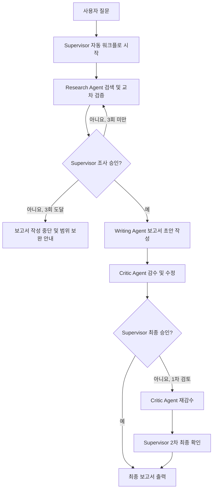
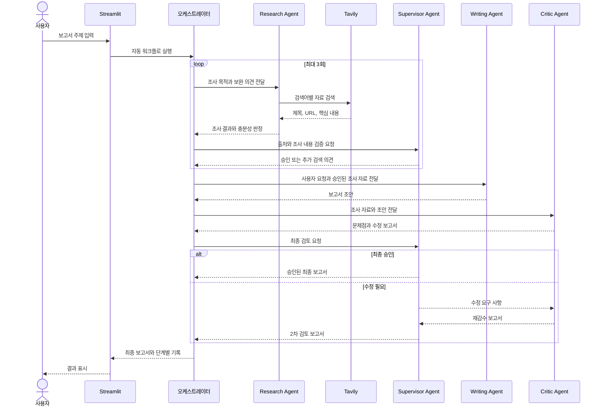

# Multi-Agent Report Orchestration

OpenAI Agents SDK와 Streamlit, 하네스 엔지니어링으로 만든 **자동 보고서 작성 애플리케이션**입니다. 

사용자가 주제를 한 번 입력하면 조사, 검증, 작성, 감수와 최종 승인 단계를 순서대로 실행합니다.

## 주요 기능

- Tavily를 이용한 최신 웹 자료 검색
- Research Agent의 출처 수집 및 교차 검증
- Supervisor Agent의 조사 충분성 승인
- 근거가 부족할 때 최대 3회 자동 재검색
- Writing Agent의 한국어 보고서 작성
- Critic Agent의 사실성·논리·표현 감수 및 수정
- Supervisor Agent의 최종 승인과 필요 시 재감수
- 검색어, 출처, 초안과 검토 의견을 단계별로 확인
- `.agent/*.md`에서 에이전트 지침 편집

## 실행 흐름

현재 애플리케이션은 모델이 임의로 다음 에이전트를 선택하는 방식이 아니라, `main.py`의 오케스트레이션 코드가 실행 순서를 보장합니다. 아래의 핸드오프는 에이전트 사이에서 작업 결과가 전달되는 **논리적 핸드오프**입니다.



### 에이전트 간 전달 순서



### 핸드오프 데이터

| 전달                           | 주요 내용                                           |
| ------------------------------ | --------------------------------------------------- |
| Orchestrator → Research Agent | 사용자 질문, 이전 조사 결과, Supervisor 보완 의견   |
| Research Agent → Supervisor   | 검색어, 핵심 발견, 출처 URL, 남은 한계, 충분성 판정 |
| Supervisor → Research Agent   | 승인 여부, 추가 확인 항목, 다음 검색 방향           |
| Supervisor → Writing Agent    | 사용자 질문, 승인된 조사 요약과 출처                |
| Writing Agent → Critic Agent  | 보고서 초안과 검증된 조사 자료                      |
| Critic Agent → Supervisor     | 감수 의견, 승인 여부, 수정된 전체 보고서            |
| Supervisor → 사용자           | 최종 검토 의견과 승인된 보고서                      |

## 프로젝트 구조

```text
.
├── .agent/
│   ├── supervisor.md       # 조사 승인 및 최종 검토 지침
│   ├── research.md         # 검색·교차 검증 지침
│   ├── writer.md           # 보고서 작성 지침
│   └── critic.md           # 감수·수정 지침
├── assets/
│   └── multi-agent.png
├── pages/
│   └── 01_PROMPTS.py       # 에이전트 프롬프트 확인·수정 화면
├── app_agents.py           # 에이전트, 검색 도구, 출력 스키마
├── main.py                 # Streamlit UI와 자동 실행 흐름
├── requirements.txt
└── .env                    # API 키 설정, Git에 커밋하지 않음
```

> 이전 `agents.py`와 `prompts/*.txt`는 사용하지 않습니다. 현재 에이전트 정의는 `app_agents.py`, 지침은 `.agent/*.md`에 있습니다.

## 설치 및 실행

### 1. Python 환경 준비

Python 3.11 이상을 권장합니다.

```bash
python3 -m venv .venv
source .venv/bin/activate
```

Windows PowerShell에서는 다음 명령을 사용합니다.

```powershell
python -m venv .venv
.venv\Scripts\Activate.ps1
```

### 2. 패키지 설치

```bash
python -m pip install --upgrade pip
python -m pip install -r requirements.txt
```

### 3. 환경 변수 설정

프로젝트 루트에 `.env` 파일을 만들고 다음 값을 입력합니다.

```dotenv
OPENAI_API_KEY=sk-여기에_OpenAI_API_키
TAVILY_API_KEY=tvly-여기에_Tavily_API_키
OPENAI_MODEL=gpt-4o
```

- `OPENAI_API_KEY`: 필수
- `TAVILY_API_KEY`: 웹 검색을 위해 권장
- `OPENAI_MODEL`: 선택 사항이며 생략하면 `gpt-4o` 사용

> `.env`에는 실제 비밀키가 들어 있으므로 Git 저장소에 커밋하거나 다른 사람에게 공유하지 마세요.

### 4. 애플리케이션 실행

```bash
streamlit run main.py
```

브라우저가 자동으로 열리지 않으면 터미널에 표시된 주소로 접속합니다. 기본 주소는 다음과 같습니다.

```text
http://localhost:8501
```

## 사용 방법

1. 사이드바에서 API 키가 정상적으로 불러와졌는지 확인합니다.
2. 필요한 경우 `사용 모델` 값을 변경합니다.
3. `단계별 처리 결과 표시`를 선택합니다.
4. 채팅 입력창에 보고서 주제와 요구사항을 한 번에 입력합니다.
5. 조사·검증·작성·감수·최종 확인이 끝날 때까지 기다립니다.
6. 최종 보고서와 `단계별 처리 결과`를 확인합니다.

좋은 입력 예시는 다음과 같습니다.

```text
2026년 양산시 여름철 폭염 대응 정책을 조사해 주세요.
현재 정책과 국내 우수 사례를 비교하고, 시민 안전을 위한 개선 방안을
공공기관 보고서 형식으로 작성해 주세요. 주요 출처 URL도 포함해 주세요.
```

## 화면 출력 예시

실제 결과는 질문과 검색 시점에 따라 달라집니다.

### 단계별 처리 결과

```text
Supervisor가 자동 보고서 작업을 시작했습니다.

1단계 · 조사 및 검증 (1/3)
🔎 search_on_web 실행 중
✅ 검색 결과 수집 완료
🧭 Supervisor가 조사 내용과 출처를 검증합니다.
🔁 Supervisor 판단에 따라 부족한 근거를 다시 검색합니다.

1단계 · 조사 및 검증 (2/3)
✅ Supervisor가 조사 결과를 승인했습니다.

2단계 · Writing Agent 보고서 작성
3단계 · Critic Agent 감수 및 수정
4단계 · Supervisor 최종 확인 (1/2)
✅ 자동 검토가 완료되었습니다.
```

`단계별 처리 결과`를 펼치면 다음 항목을 확인할 수 있습니다.

```markdown
### 조사·검증 1차

- Research Agent 충분성 판단: 추가 조사 필요
- Supervisor 승인: 보완 필요
- 사용한 검색어
- 핵심 발견
- 확인한 출처와 URL
- 부족하거나 불확실한 내용
- Supervisor 검토 의견

### Writing Agent 초안

- 조사 자료로 작성한 전체 보고서 초안

### Critic Agent 1차 감수

- 발견한 사실성·논리·표현 문제
- 문제를 반영한 수정 보고서

### Supervisor 최종 검토

- 최종 승인 여부
- 남은 수정 또는 확인 사항
```

### 최종 보고서 예시

```markdown
# 양산시 여름철 폭염 대응 정책 개선 보고서

## 1. 요약

본 보고서는 양산시 폭염 대응 정책의 현황을 검토하고 국내 우수 사례와
비교하여 시민 안전 강화를 위한 개선 방향을 제시한다.

## 2. 정책 현황

- 폭염 취약계층 보호 체계
- 무더위쉼터 운영 현황
- 재난 문자와 현장 대응 체계

## 3. 주요 분석

검증된 조사 자료를 기준으로 정책의 강점과 보완 영역을 분석한다.
확인이 제한된 사항은 별도의 한계로 표시한다.

## 4. 개선 방안

1. 취약계층 데이터 기반 사전 점검 강화
2. 무더위쉼터 접근성과 운영시간 개선
3. 보건·복지·재난 부서 간 공동 대응 지표 마련

## 5. 결론

단기 현장 대응과 중장기 예방 정책을 함께 추진하고, 성과 지표를 통해
정책 효과를 정기적으로 검증할 필요가 있다.

## 참고 자료

- 기관명, 자료명, URL
```

## 하네스 엔지니어링 수정

Streamlit 왼쪽 페이지 메뉴에서 `01_PROMPTS`를 선택하면 각 에이전트의 하네스엔지니어링 지침을 확인하고 현재 세션에 적용할 수 있습니다.

원본 지침을 영구적으로 변경하려면 다음 파일을 수정한 뒤 앱을 다시 실행합니다.

```text
.agent/supervisor.md
.agent/research.md
.agent/writer.md
.agent/critic.md
```

## 실행 제한

- 조사 재시도: 최대 3회
- Supervisor 최종 검토: 최대 2회
- 검색 결과: 호출당 최대 5건
- 검색 본문: 결과당 최대 2,500자
- 에이전트 단계 입력: 최대 45,000자
- 사용자가 분량을 지정하지 않은 보고서: 기본 12,000자 이내

이 제한은 무한 반복, 과도한 API 비용과 모델 컨텍스트 초과를 방지하기 위한 것입니다.

## 문제 해결

### `OPENAI API 키가 설정되지 않았습니다`

`.env` 파일의 `OPENAI_API_KEY` 이름과 값을 확인한 후 Streamlit을 재시작합니다.

### 웹 검색이 실행되지 않습니다

`.env`의 `TAVILY_API_KEY`를 확인합니다. 키가 없으면 앱은 검색 도구 없이 실행되므로 조사 승인을 받지 못할 수 있습니다.

### `Your input exceeds the context window`

현재 버전은 검색 원문과 단계 입력 길이를 제한합니다. 이전 서버 프로세스가 실행 중이라면 종료한 뒤 다시 시작하고, 지나치게 긴 원문을 질문에 직접 붙여 넣지 마세요.

```bash
streamlit run main.py
```

### 구조화된 조사 결과 오류

코드 변경 전 에이전트가 Streamlit 세션에 남아 있을 수 있습니다. 브라우저를 새로고침하거나 서버를 재시작하면 현재 출력 스키마로 에이전트가 다시 생성됩니다.

### `missing ScriptRunContext`

단독 Python 실행이나 테스트 중 나타날 수 있는 Streamlit 경고입니다. 앱은 반드시 다음 방식으로 실행합니다.

```bash
streamlit run main.py
```

## 보안 및 비용 주의사항

- `.env`와 API 키를 Git에 커밋하지 마세요.
- 단계별 재검색과 재검토 과정에서 OpenAI 및 Tavily API 사용량이 증가할 수 있습니다.
- 민감한 개인정보나 비공개 문서를 외부 API 입력으로 사용하기 전에 조직의 보안 정책을 확인하세요.
