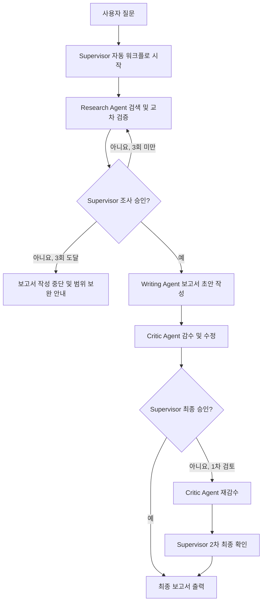
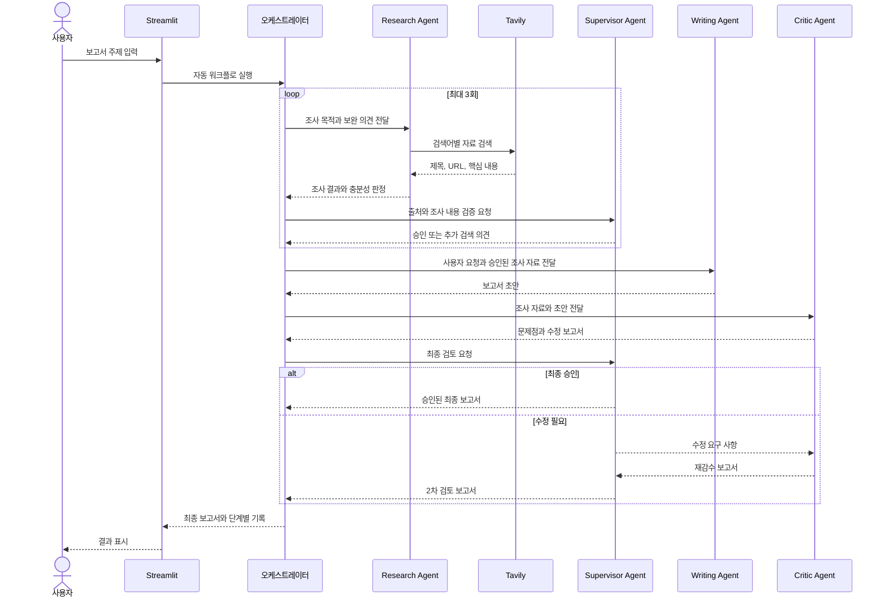

# Multi-Agent Report Orchestration

OpenAI Agents SDK와 Streamlit, 하네스 엔지니어링으로 만든 **자동 보고서 작성 애플리케이션**입니다. 

사용자가 주제를 한 번 입력하면 조사, 검증, 작성, 감수와 최종 승인 단계를 순서대로 실행합니다.

## 주요 기능

- Tavily를 이용한 최신 웹 자료 검색
- Research Agent의 출처 수집 및 교차 검증
- Supervisor Agent의 조사 충분성 승인
- 근거가 부족할 때 최대 3회 자동 재검색
- Writing Agent의 한국어 보고서 작성
- Critic Agent의 사실성·논리·표현 감수 및 수정
- Supervisor Agent의 최종 승인과 필요 시 재감수
- 검색어, 출처, 초안과 검토 의견을 단계별로 확인
- `.agent/*.md`에서 에이전트 지침 편집

## 실행 흐름

현재 애플리케이션은 모델이 임의로 다음 에이전트를 선택하는 방식이 아니라, `main.py`의 오케스트레이션 코드가 실행 순서를 보장합니다. 아래의 핸드오프는 에이전트 사이에서 작업 결과가 전달되는 **논리적 핸드오프**입니다.



### 에이전트 간 전달 순서



### 핸드오프 데이터

| 전달                           | 주요 내용                                           |
| ------------------------------ | --------------------------------------------------- |
| Orchestrator → Research Agent | 사용자 질문, 이전 조사 결과, Supervisor 보완 의견   |
| Research Agent → Supervisor   | 검색어, 핵심 발견, 출처 URL, 남은 한계, 충분성 판정 |
| Supervisor → Research Agent   | 승인 여부, 추가 확인 항목, 다음 검색 방향           |
| Supervisor → Writing Agent    | 사용자 질문, 승인된 조사 요약과 출처                |
| Writing Agent → Critic Agent  | 보고서 초안과 검증된 조사 자료                      |
| Critic Agent → Supervisor     | 감수 의견, 승인 여부, 수정된 전체 보고서            |
| Supervisor → 사용자           | 최종 검토 의견과 승인된 보고서                      |

## 프로젝트 구조

```text
.
├── .agent/
│   ├── supervisor.md       # 조사 승인 및 최종 검토 지침
│   ├── research.md         # 검색·교차 검증 지침
│   ├── writer.md           # 보고서 작성 지침
│   └── critic.md           # 감수·수정 지침
├── assets/
│   └── multi-agent.png
├── pages/
│   └── 01_PROMPTS.py       # 에이전트 프롬프트 확인·수정 화면
├── app_agents.py           # 에이전트, 검색 도구, 출력 스키마
├── main.py                 # Streamlit UI와 자동 실행 흐름
├── requirements.txt
└── .env                    # API 키 설정, Git에 커밋하지 않음
```

> 이전 `agents.py`와 `prompts/*.txt`는 사용하지 않습니다. 현재 에이전트 정의는 `app_agents.py`, 지침은 `.agent/*.md`에 있습니다.

## 설치 및 실행

### 1. Python 환경 준비

Python 3.11 이상을 권장합니다.

```bash
python3 -m venv .venv
source .venv/bin/activate
```

Windows PowerShell에서는 다음 명령을 사용합니다.

```powershell
python -m venv .venv
.venv\Scripts\Activate.ps1
```

### 2. 패키지 설치

```bash
python -m pip install --upgrade pip
python -m pip install -r requirements.txt
```

### 3. 환경 변수 설정

프로젝트 루트에 `.env` 파일을 만들고 다음 값을 입력합니다.

```dotenv
OPENAI_API_KEY=sk-여기에_OpenAI_API_키
TAVILY_API_KEY=tvly-여기에_Tavily_API_키
OPENAI_MODEL=gpt-4o
```

- `OPENAI_API_KEY`: 필수
- `TAVILY_API_KEY`: 웹 검색을 위해 권장
- `OPENAI_MODEL`: 선택 사항이며 생략하면 `gpt-4o` 사용

> `.env`에는 실제 비밀키가 들어 있으므로 Git 저장소에 커밋하거나 다른 사람에게 공유하지 마세요.

### 4. 애플리케이션 실행

```bash
streamlit run main.py
```

브라우저가 자동으로 열리지 않으면 터미널에 표시된 주소로 접속합니다. 기본 주소는 다음과 같습니다.

```text
http://localhost:8501
```

## 사용 방법

1. 사이드바에서 API 키가 정상적으로 불러와졌는지 확인합니다.
2. 필요한 경우 `사용 모델` 값을 변경합니다.
3. `단계별 처리 결과 표시`를 선택합니다.
4. 채팅 입력창에 보고서 주제와 요구사항을 한 번에 입력합니다.
5. 조사·검증·작성·감수·최종 확인이 끝날 때까지 기다립니다.
6. 최종 보고서와 `단계별 처리 결과`를 확인합니다.

좋은 입력 예시는 다음과 같습니다.

```text
2026년 양산시 여름철 폭염 대응 정책을 조사해 주세요.
현재 정책과 국내 우수 사례를 비교하고, 시민 안전을 위한 개선 방안을
공공기관 보고서 형식으로 작성해 주세요. 주요 출처 URL도 포함해 주세요.
```

## 화면 출력 예시

실제 결과는 질문과 검색 시점에 따라 달라집니다.

### 단계별 처리 결과

```text
Supervisor가 자동 보고서 작업을 시작했습니다.

1단계 · 조사 및 검증 (1/3)
🔎 search_on_web 실행 중
✅ 검색 결과 수집 완료
🧭 Supervisor가 조사 내용과 출처를 검증합니다.
🔁 Supervisor 판단에 따라 부족한 근거를 다시 검색합니다.

1단계 · 조사 및 검증 (2/3)
✅ Supervisor가 조사 결과를 승인했습니다.

2단계 · Writing Agent 보고서 작성
3단계 · Critic Agent 감수 및 수정
4단계 · Supervisor 최종 확인 (1/2)
✅ 자동 검토가 완료되었습니다.
```

`단계별 처리 결과`를 펼치면 다음 항목을 확인할 수 있습니다.

```markdown
### 조사·검증 1차

- Research Agent 충분성 판단: 추가 조사 필요
- Supervisor 승인: 보완 필요
- 사용한 검색어
- 핵심 발견
- 확인한 출처와 URL
- 부족하거나 불확실한 내용
- Supervisor 검토 의견

### Writing Agent 초안

- 조사 자료로 작성한 전체 보고서 초안

### Critic Agent 1차 감수

- 발견한 사실성·논리·표현 문제
- 문제를 반영한 수정 보고서

### Supervisor 최종 검토

- 최종 승인 여부
- 남은 수정 또는 확인 사항
```

### 최종 보고서 예시

아래 내용은 화면 구성과 보고서 형식을 보여주기 위한 예시이며, 실제 정책 현황이나 수치는 실행 시점의 검색 결과로 다시 검증해야 합니다.

# 양산시 여름철 폭염 대응 정책 개선 보고서

## 1. 보고서 요약

본 보고서는 양산시의 여름철 폭염 대응 체계를 시민 안전 관점에서 검토하고,
국내 지방자치단체의 우수 운영 사례와 비교하여 실행 가능한 개선 과제를
제안하는 것을 목적으로 한다.

분석 결과, 폭염 대응은 단순한 시설 확대보다 취약계층 조기 발굴, 생활권별
쉼터 접근성, 현장 대응기관 간 정보 공유와 성과 측정 체계를 함께 강화하는
방향으로 추진할 필요가 있다.

### 핵심 제안

1. 건강·복지 데이터를 활용한 폭염 취약계층 사전 점검 체계 구축
2. 도보 생활권을 기준으로 무더위쉼터의 위치와 운영시간 재설계
3. 재난·보건·복지 부서가 공동으로 사용하는 상황관리 지표 마련
4. 폭염특보 단계별 현장 대응 절차와 책임기관 명확화
5. 시민 체감도와 건강 피해 감소를 포함한 정책 성과평가 실시

## 2. 조사 배경과 목적

### 2.1 조사 배경

폭염은 고령자, 독거가구, 야외근로자와 만성질환자에게 상대적으로 큰 영향을
줄 수 있다. 따라서 지방정부의 폭염 대응은 기상특보 전달뿐 아니라 취약계층
보호, 쉼터 운영, 현장 점검과 응급 대응을 하나의 체계로 연결해야 한다.

### 2.2 조사 목적

- 양산시 폭염 대응 정책과 운영체계 파악
- 시민 이용 관점에서 정책의 강점과 사각지대 분석
- 다른 지방자치단체의 적용 가능한 사례 비교
- 단기·중기 실행과제와 측정 가능한 성과지표 제안

### 2.3 조사 범위와 방법

- 지방정부와 관계기관의 공개자료 검토
- 폭염 취약계층 보호, 무더위쉼터, 현장 대응 정책 비교
- 서로 독립적인 출처를 통한 주요 주장 교차 검증
- 확인되지 않은 내용은 정책 현황과 분리하여 한계로 표시

## 3. 현행 대응체계 분석

### 3.1 취약계층 보호

폭염 취약계층 보호 정책은 대상자 목록의 최신성, 담당 인력의 점검 주기와
응급상황 발생 시 연계 절차가 핵심이다. 단순 안부 확인 실적보다 실제 위험
요인이 발견되고 지원으로 연결된 비율을 관리할 필요가 있다.

### 3.2 무더위쉼터 운영

쉼터는 지정 개수보다 시민이 필요한 시간에 실제로 접근하고 이용할 수 있는지가
중요하다. 위치, 운영시간, 냉방 상태, 장애인 접근성과 대중교통 연결성을 함께
점검해야 한다.

### 3.3 정보 전달과 현장 대응

재난문자와 홍보물은 신속한 정보 전달에 유용하지만, 정보 취약계층에게는
방문·전화·지역 공동체를 활용한 보완 수단이 필요하다. 야외근로자 보호를 위해서는
사업장 점검과 휴식시간 안내도 지역 대응체계에 포함할 필요가 있다.

## 4. 국내 사례 비교

| 비교 영역 | 사례에서 확인할 요소 | 양산시 적용 방향 |
|---|---|---|
| 취약계층 관리 | 대상자 발굴 방식과 점검 주기 | 복지·보건 정보를 활용한 위험도 분류 |
| 쉼터 운영 | 야간·주말 운영과 실시간 정보 | 생활권별 수요에 따른 탄력 운영 |
| 현장 대응 | 부서·기관별 역할과 상황 공유 | 공동 상황판과 단계별 책임기관 지정 |
| 시민 참여 | 자원봉사자와 지역단체 활용 | 이·통장 및 민간단체 협력망 정비 |
| 성과평가 | 건강 피해와 이용자 만족도 | 정량·정성 지표를 결합한 평가 |

사례를 적용할 때는 다른 지역의 사업 명칭을 그대로 도입하기보다 인구구조,
도농 복합지역 특성, 대중교통과 의료 접근성을 고려하여 조정해야 한다.

## 5. 문제점과 개선 필요사항

### 5.1 대상자 정보의 분산 가능성

부서별로 관리되는 대상자 정보가 적시에 연결되지 않으면 중복 점검이나 보호
누락이 발생할 수 있다. 개인정보 보호 원칙을 지키면서 업무에 필요한 최소 정보와
연계 절차를 명확히 해야 한다.

### 5.2 공급 중심의 쉼터 관리

쉼터 수만 관리하면 실제 이용 가능 시간과 접근성 문제가 드러나지 않을 수 있다.
생활권별 인구와 이용 실적을 기준으로 운영 적정성을 평가해야 한다.

### 5.3 성과지표 부족

홍보 횟수나 점검 건수만으로는 시민 안전 개선 효과를 판단하기 어렵다. 건강 피해,
응급 이송, 쉼터 이용 만족도와 취약가구 지원 연결률을 함께 관리할 필요가 있다.

## 6. 정책 개선방안

### 과제 1. 폭염 취약계층 위험도 기반 관리

- 고령, 독거, 만성질환, 주거환경 등 위험요인을 기준으로 점검 우선순위 설정
- 폭염특보 전 대상자 정보와 연락망 정비
- 미응답·고위험 가구에 대한 현장 확인 절차 마련
- 발견된 복지·의료 수요를 담당기관에 즉시 연계

### 과제 2. 생활권 중심 무더위쉼터 개선

- 도보 접근시간과 대중교통을 반영한 공간 분석
- 야간·주말 수요가 높은 지역의 탄력 운영
- 위치, 운영시간과 혼잡도를 확인할 수 있는 시민 안내 제공
- 냉방 상태, 식수, 휴식공간과 장애인 접근성 정기 점검

### 과제 3. 통합 상황관리 체계 구축

- 재난안전·보건·복지·읍면동 담당자의 공통 상황판 운영
- 폭염특보 단계별 점검 대상, 조치사항과 보고기한 표준화
- 소방·의료기관과 응급상황 공유 및 사후 검토 절차 마련

### 과제 4. 시민·사업장 참여 강화

- 지역단체와 협력하여 정보 취약가구에 행동요령 전달
- 야외근로 사업장에 휴식·그늘·수분 제공 지침 안내
- 시민 신고와 불편사항을 정책 개선에 반영하는 창구 운영

## 7. 단계별 실행계획

| 구분 | 기간 | 주요 실행과제 | 담당 주체 예시 |
|---|---|---|---|
| 단기 | 폭염대책기간 전 | 대상자·쉼터 현황 정비, 연락망 점검 | 재난·복지·읍면동 |
| 단기 | 폭염특보 기간 | 고위험가구 확인, 쉼터 탄력 운영 | 읍면동·보건·민간협력기관 |
| 중기 | 6개월 이내 | 생활권 분석, 공동 상황관리 지표 설계 | 재난·정보·교통 부서 |
| 중기 | 1년 이내 | 정책 성과평가와 다음 연도 계획 반영 | 총괄부서·외부 평가기관 |

## 8. 성과지표 제안

| 성과 영역 | 지표 예시 | 측정 방법 |
|---|---|---|
| 취약계층 보호 | 고위험가구 사전 접촉률 | 대상자 대비 접촉 완료 비율 |
| 지원 연계 | 위험 발견 후 서비스 연계율 | 발견 건수 대비 지원 연결 건수 |
| 쉼터 접근성 | 생활권 내 쉼터 접근 가능 인구 비율 | 공간·인구 데이터 분석 |
| 운영 품질 | 쉼터 정상 운영률과 이용 만족도 | 현장 점검 및 이용자 조사 |
| 건강 안전 | 온열질환·응급이송 추이 | 관계기관 통계의 전년 대비 분석 |
| 협업 수준 | 기관 간 조치 완료시간 | 상황 접수부터 처리까지 소요시간 |

## 9. 위험요인과 대응방안

| 위험요인 | 예상 문제 | 대응방안 |
|---|---|---|
| 개인정보 연계 | 과도한 정보 공유 우려 | 최소 정보 원칙과 접근권한 관리 |
| 담당 인력 부족 | 점검 지연과 업무 집중 | 위험도별 우선순위와 민간 협력 활용 |
| 쉼터 이용 저조 | 시설 대비 낮은 정책 체감도 | 위치·시간 개선과 이용자 조사 병행 |
| 부서 간 역할 중복 | 보고 지연과 책임 불명확 | 단계별 업무분장과 공동 상황판 운영 |

## 10. 결론 및 제언

양산시 폭염 대응은 시설과 홍보 실적 중심의 관리에서 시민별 위험과 실제 서비스
접근성을 관리하는 방식으로 발전할 필요가 있다. 우선 폭염대책기간 전 대상자와
쉼터 정보를 정비하고, 이후 통합 상황관리와 성과평가 체계를 단계적으로 구축하는
것이 현실적이다.

최종 정책 결정 전에는 양산시의 최신 공식 계획, 쉼터 운영자료, 온열질환 현황과
예산·인력 자료를 추가 확인하여 과제별 목표치를 확정해야 한다.

## 11. 조사 한계

- 공개되지 않은 내부 운영자료와 개인정보 기반 대상자 현황은 확인에 제한이 있음
- 기관별 통계의 작성 시점과 기준이 다를 수 있으므로 직접 비교 시 주의가 필요함
- 우수 사례는 지역 여건이 다르므로 시범사업을 거쳐 적용 효과를 검증해야 함

## 12. 참고자료

- 양산시, 폭염 대응 관련 최신 공식 계획, URL
- 행정안전부, 여름철 자연재난 대책 관련 자료, URL
- 질병관리청, 온열질환 응급실감시체계 자료, URL
- 기상청, 폭염특보 및 기후통계 자료, URL
- 비교 지방자치단체 공식 폭염 대응 자료, URL

## 하네스 엔지니어링 수정

Streamlit 왼쪽 페이지 메뉴에서 `01_PROMPTS`를 선택하면 각 에이전트의 하네스엔지니어링 지침을 확인하고 현재 세션에 적용할 수 있습니다.

원본 지침을 영구적으로 변경하려면 다음 파일을 수정한 뒤 앱을 다시 실행합니다.

```text
.agent/supervisor.md
.agent/research.md
.agent/writer.md
.agent/critic.md
```

## 실행 제한

- 조사 재시도: 최대 3회
- Supervisor 최종 검토: 최대 2회
- 검색 결과: 호출당 최대 5건
- 검색 본문: 결과당 최대 2,500자
- 에이전트 단계 입력: 최대 45,000자
- 사용자가 분량을 지정하지 않은 보고서: 기본 12,000자 이내

이 제한은 무한 반복, 과도한 API 비용과 모델 컨텍스트 초과를 방지하기 위한 것입니다.

## 문제 해결

### `OPENAI API 키가 설정되지 않았습니다`

`.env` 파일의 `OPENAI_API_KEY` 이름과 값을 확인한 후 Streamlit을 재시작합니다.

### 웹 검색이 실행되지 않습니다

`.env`의 `TAVILY_API_KEY`를 확인합니다. 키가 없으면 앱은 검색 도구 없이 실행되므로 조사 승인을 받지 못할 수 있습니다.

### `Your input exceeds the context window`

현재 버전은 검색 원문과 단계 입력 길이를 제한합니다. 이전 서버 프로세스가 실행 중이라면 종료한 뒤 다시 시작하고, 지나치게 긴 원문을 질문에 직접 붙여 넣지 마세요.

```bash
streamlit run main.py
```

### 구조화된 조사 결과 오류

코드 변경 전 에이전트가 Streamlit 세션에 남아 있을 수 있습니다. 브라우저를 새로고침하거나 서버를 재시작하면 현재 출력 스키마로 에이전트가 다시 생성됩니다.

### `missing ScriptRunContext`

단독 Python 실행이나 테스트 중 나타날 수 있는 Streamlit 경고입니다. 앱은 반드시 다음 방식으로 실행합니다.

```bash
streamlit run main.py
```

## 보안 및 비용 주의사항

- `.env`와 API 키를 Git에 커밋하지 마세요.
- 단계별 재검색과 재검토 과정에서 OpenAI 및 Tavily API 사용량이 증가할 수 있습니다.
- 민감한 개인정보나 비공개 문서를 외부 API 입력으로 사용하기 전에 조직의 보안 정책을 확인하세요.
